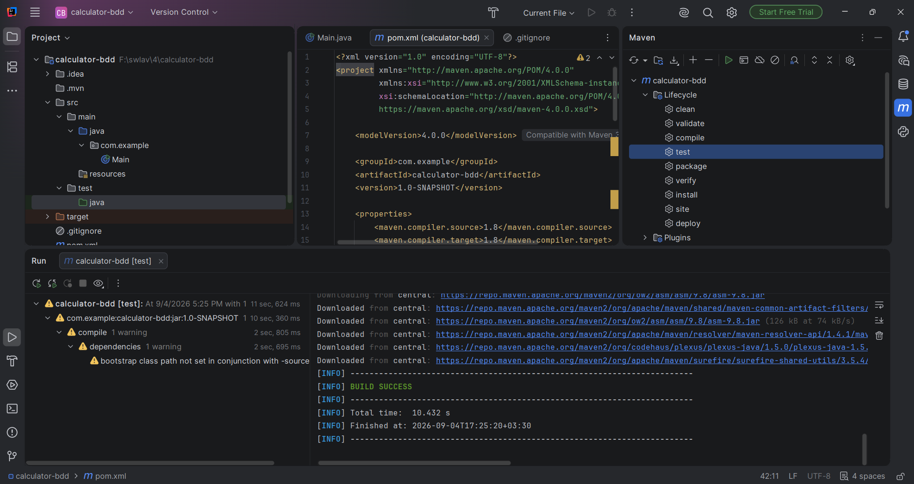
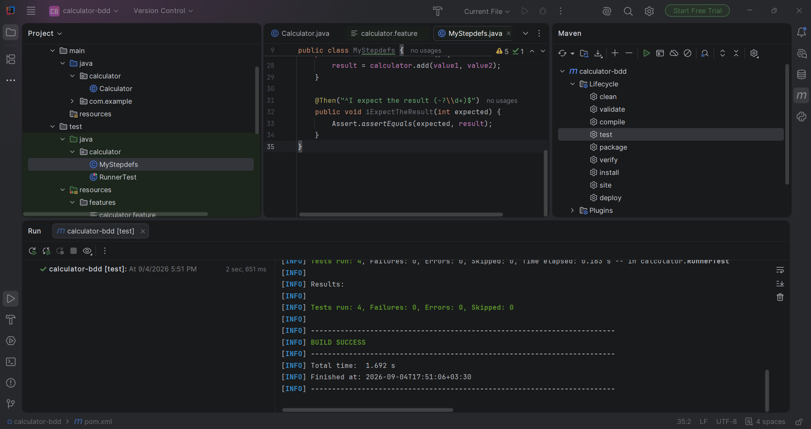
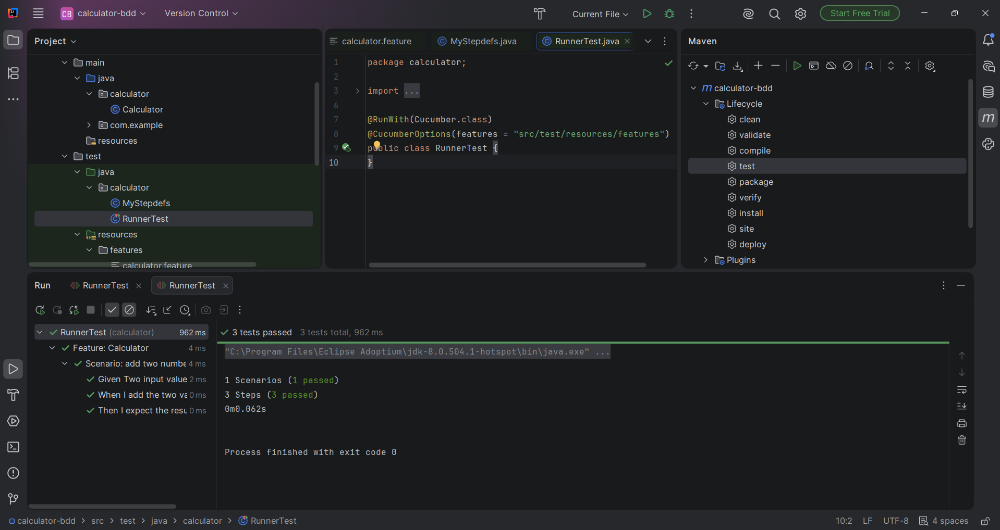
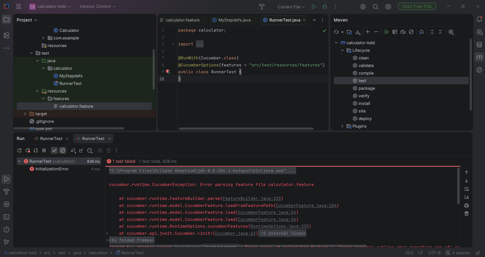
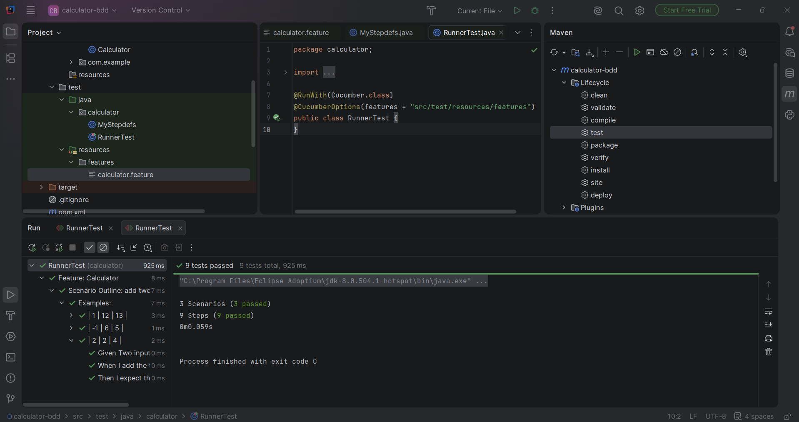
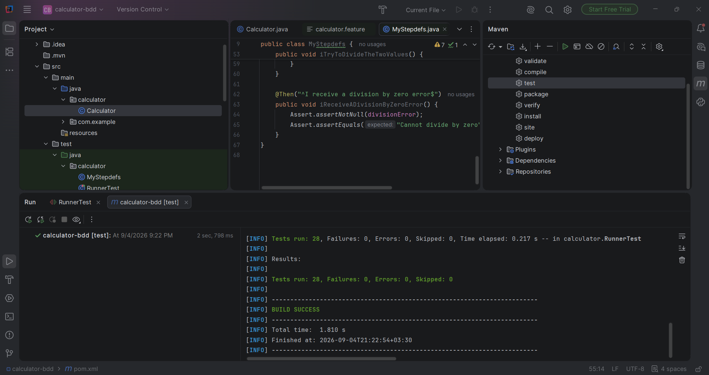

# گزارش آزمایش BDD با Cucumber و Java

**درس:** آزمایشگاه مهندسی نرم‌افزار

**دانشجو:** امیرهمایون شریفی‌زاده

**شماره دانشجویی:** 401106114
**تاریخ:** ۴ سپتامبر ۲۰۲۶

---

## فهرست مطالب

1. [هدف آزمایش](#هدف-آزمایش)
2. [ابزارها و پیش‌نیازها](#ابزارها-و-پیشنیازها)
3. [روند انجام آزمایش](#روند-انجام-آزمایش)
4. [پیاده‌سازی ماشین‌حساب](#پیادهسازی-ماشینحساب)
5. [سناریوهای BDD](#سناریوهای-bdd)
6. [خطاهای مشاهده‌شده و راه‌حل‌ها](#خطاهای-مشاهدهشده-و-راهحلها)
7. [نتیجهٔ نهایی](#نتیجه-نهایی)
8. [ساختار پروژه](#ساختار-پروژه)
9. [نحوهٔ اجرا](#نحوهٔ-اجرا)

---

## هدف آزمایش

هدف این آزمایش، آشنایی با توسعهٔ مبتنی بر رفتار (**Behavior-Driven Development** یا **BDD**) با استفاده از **Cucumber**، **Java** و **JUnit** است.

در BDD ابتدا رفتار مورد انتظار سیستم با زبان Gherkin نوشته می‌شود؛ سپس Step Definitionها این رفتار را به کد Java متصل می‌کنند و در نهایت تست به‌صورت خودکار اجرا می‌شود.

```text
Requirement → Feature File (Gherkin) → Step Definitions → Application Code → Automated Test
```

در این پروژه یک ماشین‌حساب برای دو عدد صحیح پیاده‌سازی شده است که عملگرهای زیر را پشتیبانی می‌کند:

- جمع: `+`
- ضرب: `*`
- تقسیم: `/`
- توان: `^`

عملیات توان با **ضرب تکراری** پیاده‌سازی شده است. همچنین تقسیم بر صفر به‌صورت یک خطای قابل‌تست مدیریت می‌شود.

---

## ابزارها و پیش‌نیازها

| ابزار | نسخه / کاربرد |
| --- | --- |
| IntelliJ IDEA | محیط توسعه |
| Java | Eclipse Temurin JDK 8 |
| Maven | مدیریت وابستگی‌ها و اجرای تست |
| Cucumber | نسخه `1.2.5` برای BDD |
| JUnit | نسخه `4.12` برای اجرای تست‌ها |

> Cucumber 1.2.5 با Javaهای جدید ناسازگار است؛ بنابراین Maven باید با **JDK 8** اجرا شود.

---

## روند انجام آزمایش

### ۱. ایجاد و اجرای پروژهٔ Maven

پروژهٔ Maven در IntelliJ ایجاد شد و وابستگی‌های Cucumber و JUnit در `pom.xml` قرار گرفتند. تصویر زیر اجرای موفق Maven را نشان می‌دهد.



وابستگی‌های اصلی پروژه:

```xml
<dependency>
    <groupId>info.cukes</groupId>
    <artifactId>cucumber-java</artifactId>
    <version>1.2.5</version>
    <scope>test</scope>
</dependency>

<dependency>
    <groupId>junit</groupId>
    <artifactId>junit</artifactId>
    <version>4.12</version>
    <scope>test</scope>
</dependency>
```

### ۲. پیاده‌سازی مثال اولیهٔ BDD

ابتدا یک سناریوی ساده برای جمع دو عدد نوشته و اجرا شد. تصویر زیر Step Definition اولیه و اجرای Maven را نشان می‌دهد.



سناریوی اولیه با موفقیت اجرا شد:



---

## پیاده‌سازی ماشین‌حساب

کلاس `Calculator` چهار عمل اصلی را در خود نگه می‌دارد:

```java
public class Calculator {
    public int add(int a, int b) {
        return a + b;
    }

    public int multiply(int first, int second) {
        return first * second;
    }

    public double divide(int first, int second) {
        if (second == 0) {
            throw new ArithmeticException("Cannot divide by zero");
        }
        return (double) first / second;
    }

    public double power(int base, int exponent) {
        if (exponent < 0) {
            throw new IllegalArgumentException("Exponent must be zero or positive");
        }

        double result = 1;
        for (int i = 0; i < exponent; i++) {
            result *= base;
        }
        return result;
    }
}
```

- نتیجهٔ تقسیم از نوع `double` است؛ بنابراین برای مثال `5 / 2` برابر `2.5` می‌شود.
- توان صفر برابر `1` است.
- توان منفی در محدودهٔ این تمرین نیست و خطای مشخص ایجاد می‌کند.
- تقسیم بر صفر با `ArithmeticException` متوقف می‌شود.

---

## سناریوهای BDD

### سناریوهای عادی

برای هر عملگر یک سناریوی مستقل نوشته شده است. یک سناریوی اضافی نیز تقسیم بر صفر را بررسی می‌کند.

```gherkin
Scenario: multiply two numbers
  Given Two input values, 6 and 2
  When I select the "*" operation
  Then I expect the result 12

Scenario: reject division by zero
  Given Two input values, 6 and 0
  When I try to divide the two values
  Then I receive a division by zero error
```

### Scenario Outline

برای پوشش چند ورودی با یک سناریو، از `Scenario Outline` استفاده شده است:

```gherkin
Scenario Outline: calculate with an operator
  Given Two input values, <first> and <second>
  When I select the "<opt>" operation
  Then I expect the result <result>

Examples:
  | first | second | opt | result |
  | 6     | 2      | +   | 8      |
  | 6     | 2      | *   | 12     |
  | 6     | 2      | /   | 3      |
  | 6     | 2      | ^   | 36     |
```

Step Definitions عملگر را دریافت می‌کنند و با `switch` متد صحیح را اجرا می‌کنند. نتیجهٔ عددی با دقت `0.0001` مقایسه می‌شود تا مقایسهٔ اعداد اعشاری قابل‌اعتماد باشد.

---

## خطاهای مشاهده‌شده و راه‌حل‌ها

### خطای parse شدن Feature File

در یکی از اجراها، فایل feature با `Scenario Outline` شروع شده بود و Cucumber خطای parse صادر کرد؛ زیرا هر فایل Gherkin باید ابتدا با `Feature:` آغاز شود.



این خطا با قرار دادن خط زیر در ابتدای فایل برطرف شد:

```gherkin
Feature: Calculator
```

### اجرای موفق Scenario Outline

پس از اصلاح ساختار فایل، نمونه‌های Outline با موفقیت اجرا شدند:



### سازگاری Cucumber با Java

نسخهٔ قدیمی Cucumber در Javaهای جدید با خطای دسترسی ماژول روبه‌رو می‌شود. اجرای Maven با JDK 8 این مشکل را رفع کرد.



---

## نتیجهٔ نهایی

در اجرای نهایی پروژه با JDK 8، همهٔ سناریوها پاس شدند:

```text
9 Scenarios (9 passed)
27 Steps (27 passed)
BUILD SUCCESS
```

| مورد | تعداد | وضعیت |
| --- | ---: | --- |
| سناریوهای عادی جمع، ضرب، تقسیم و توان | 4 | Passed |
| سناریوی تقسیم بر صفر | 1 | Passed |
| نمونه‌های Scenario Outline | 4 | Passed |
| **مجموع سناریوها** | **9** | **All passed** |

---

## ساختار پروژه

```text
calculator-bdd/
├── pom.xml
├── README.md
├── REPORT.md
├── PLAN.md
├── IMPLEMENTATION_NOTES.md
├── screenshots/
│   ├── 01-maven-build.png
│   ├── 02-initial-stepdefs.png
│   ├── 03-initial-scenario-passed.png
│   ├── 04-feature-parse-error.png
│   ├── 05-outline-passed.png
│   └── 06-maven-test-passed.png
└── src/
    ├── main/java/calculator/Calculator.java
    └── test/
        ├── java/calculator/
        │   ├── MyStepdefs.java
        │   └── RunnerTest.java
        └── resources/features/calculator.feature
```

## نحوهٔ اجرا

1. JDK 8 را در IntelliJ به‌عنوان Maven Runner JRE انتخاب کنید:

   ```text
   Settings → Build, Execution, Deployment → Build Tools → Maven → Runner
   ```

2. در پنجرهٔ Maven، گزینهٔ **Lifecycle → test** را اجرا کنید؛ یا در ترمینال پروژه بنویسید:

   ```bash
   mvn test
   ```

3. خروجی مورد انتظار `BUILD SUCCESS` و پاس شدن تمام ۹ سناریو است.
